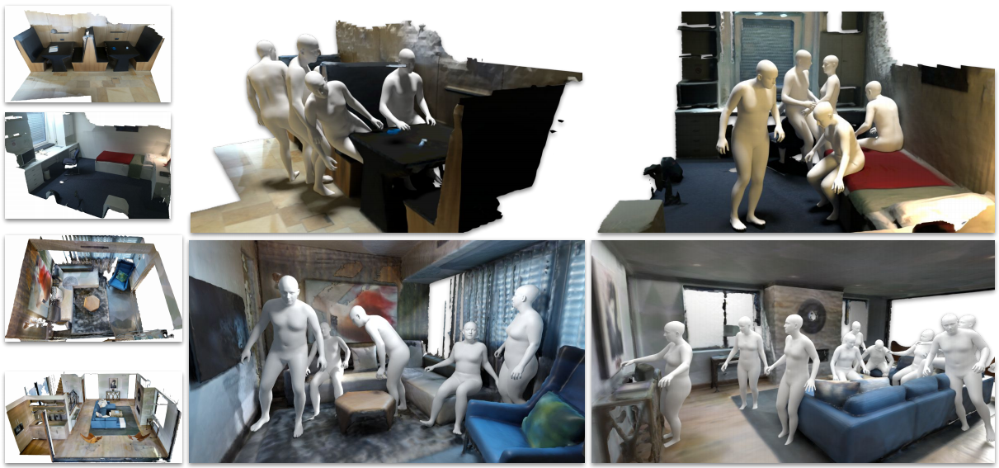
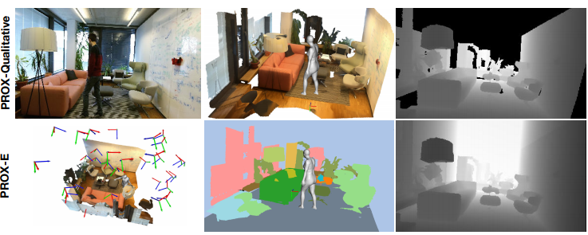
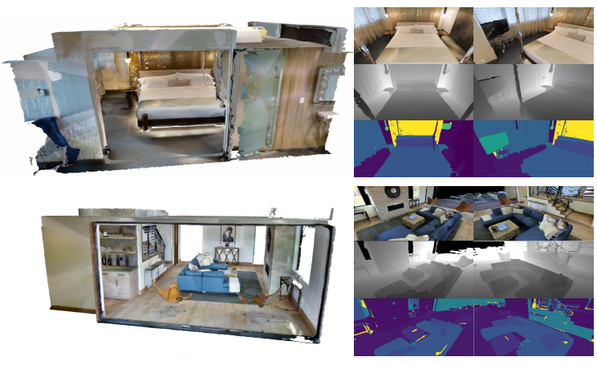

# People-Scene Interaction (PSI)
This is the code page for people-scene interaction modeling, and generating 3D people in scenes without people. 




## License & Citation
Software Copyright License for non-commercial scientific research purposes. Please read carefully the [terms and conditions](LICENSE) and any accompanying documentation before you download and/or use the model, data and software, (the "Model & Software"), including 3D meshes, blend weights, blend shapes, textures, software, scripts, and animations. By downloading and/or using the Model & Software (including downloading, cloning, installing, and any other use of this github repository), you acknowledge that you have read these terms and conditions, understand them, and agree to be bound by them. If you do not agree with these terms and conditions, you must not download and/or use the Model & Software. Any infringement of the terms of this agreement will automatically terminate your rights under this [License](LICENSE). Note that this license applies to our __PSI__ work. For the use of __SMPL-X__, __PROX__, __Matterport3D__ and other dependencies, you need to agree their licenses. 


When using the code/figures/data/video/etc., please cite our work
```
@inproceedings{PSI:2019,
  title = {Generating 3D People in Scenes without People},
  author = {Zhang, Yan and Hassan, Mohamed and Neumann, Heiko and Black, Michael J. and Tang, Siyu},
  booktitle = {Computer Vision and Pattern Recognition (CVPR)},
  month = jun,
  year = {2020},
  url = {https://arxiv.org/abs/1912.02923},
  month_numeric = {6}
}
```


___
## Code Description

It is noted to check the *paths* in scripts before running the code; otherwise errors occur. 


### Content
  * `chamfer_pytorch` The third-part dependency for computing Chamfer loss, see below.
  * `human_body_prior` The third-part dependency for VPoser, see below.
  * `data/ade20_to_mp3dlabel.npy` The dictionary to map annotation from ADE20K to Matterport3D.
  * `data/resnet18.pth` The pre-trained ResNet for scene encoding in our work.
  * `frontend_sh_scripts` The bash scripts using the python scripts.
  * `source` The python code of model, data loading, training, testing and fitting.
  * `utils` The python code of evaluation, visualization and others.
  * `demo.ipynb` The script for an interactive demo.
  * `checkpoints` Trained models are put here.
  * `body_models` SMPL-X body mesh model, and VPoser. See below.


### Dependencies
Note that different dependency versions may lead to different results from ours.

Install requirements via:
```
pip install -r requirements.txt
```

Install the following packages following their individual instructions:
  1. [Perceiving Systems Mesh Package](https://github.com/MPI-IS/mesh)
  2. [Chamfer Pytorch](https://github.com/ThibaultGROUEIX/ChamferDistancePytorch/tree/719b0f1ca5ba370616cb837c03ab88d9a88173ff), which is also included in our repo.
  3. [Human Body Prior](https://github.com/nghorbani/human_body_prior), which is also included in our repo.
  4. [SMPL-X](https://github.com/vchoutas/smplify-x)


### Examples

We provide a `demo.ipynb` file to summarize our methods. To perform systematic experiments, we recommend to use traing, fitting and evaluation scripts in `frontend_sh_scripts`. To visualize the test results, one can check `utils_show_test_results.py`, `utils_show_test_results_habitat.py` and `run_render.sh` for details.

___
## Datasets

### PROX-E



The __PROX-E__ dataset is developed on top of [PROX](https://prox.is.tue.mpg.de/), and one can see the comparison between __PROX__ and __PROX-E__ in our manuscript. When using __PROX-E__, please first download the __PROX__ dataset, and also cite [PROX](https://prox.is.tue.mpg.de/). As an expansion pack of __PROX__, we additionally provide scene meshes with semantic annotation, scene/human body data captured from virutal and real cameras, and other auxilariy files.

__PROX-E__ can be downloaded [here](https://drive.google.com/file/d/1KB1Ic6HSD1a68ioLllxitL0lpVk56FxG/view?usp=sharing). After downloading __PROX__ and the __PROXE__ expansion pack, there will be:
  1. `body_segments` The body segments from __PROX__.
  2. `PROXE_box_verts.json` The vertices of virtual walls, fitted ceiling and floors.
  3. `scenes` The scene mesh from __PROX__.
  4. `scenes_downsampled` The downsampled scene mesh.
  5. `scenes_sdf` The signed distance function of scenes.
  6. `scenes_semantics` The scene mesh with vertex color as object ID. Note: `verts_id=np.asarray(mesh.vertex_colors)*255/5.0`.
  7. `snapshot_for_testing` The snapshot from the real camera of __PROX__ test scenes. Each mat file has the body configurations, scene depth/semantics, and camera pose of each frame. These files ease to load data during testing phase.
  8. `realcams.hdf5` The compact file of real camera snapshots, for which the frame rate is downsampled.
  9. `virtualcams.hdf5` The compact file of virtual camera snapshots. See `batch_gen_hdf5.py` for how to use these h5 files.

Note that the __PROXE__ expansion pack may update as __PROX__ updates.


### MP3D-R



We trim the room meshes from [Matterport3D](https://github.com/niessner/Matterport) according to the room bounding box annotation, and capture scene depth/semantics using the [Habitat simulator](https://aihabitat.org/). Details are referred to our manuscript. Here we provide the scene names/ids, camera poses, captured depth/segmentation, and SDFs of the used scene meshes. Due to the data use agreement, we encourage users to download __Matterport3D__ and install __Habitat simulator__, and then extract the corresponding scene meshes used in our work.

__MP3D-R__ can be downloaded [here](https://drive.google.com/file/d/1A6ecDjPt7hGBaxFI61QVogWNyGon_FJg/view?usp=sharing). The package has:
  1. `{room_name}-sensor` The captured RGB/Depth/Semantics, as well as the camera poses. NOTE: the camera pose is relative to the *world coordinate of the original Matterport3D building mesh*, while the generated body meshes are relative to the camera coordinate. An additional transformation is necessary. See `utils_show_test_results_habitat.py` for our implementation. 
  2. `sdf` The computed signed distance function of the room meshes.
  3. `*.png` Rendered images of our extracted scene meshes.


___
## Models

### Body Mesh Models
We use [SMPL-X](https://smpl-x.is.tue.mpg.de/) to represent human bodies in our work. Besides installing the `smplx` module, users also need to download the smplx model and the VPoser model, as demonstrated in [SMPL-X](https://smpl-x.is.tue.mpg.de/). It is noticed that different versions of `smplx` and `VPoser` will influece our generation results.


### Our Trained Checkpoints
One can download our trained checkpoints [here](https://drive.google.com/file/d/1w9Sl94ku6L7nwBzdXsApSQO1lOf-yFCB/view?usp=sharing). The used hyper-parameters are included in the filename. For example,
```
checkpoints_proxtrain_modelS1_batch32_epoch30_LR0.0003_LossVposer0.001_LossKL0.1_LossContact0.001_LossCollision0.01
```
means using data in __PROXE__ training scenes, stage-one model, batch size 32, epoch 30, learning rate 0.0003, as well as the specified loss weights.


___
## Acknowledgments & Disclosure 
__Acknowledgments.__ We sincerely acknowledge: Joachim Tesch for all his work on rendering images and other graphics supports. Xueting Li for implementation advice about the baseline. David Hoffmann, Jinlong Yang, Vasileios Choutas, Ahmed Osman, Nima Ghorbani and Dimitrios Tzionas for insightful discussions on SMPL-X, VPoser and others. Daniel Scharstein and Cornelia Köhler for proof reading. Benjamin Pellkofer and Mason Landry for IT/hardware supports. Y. Z. and S. T. acknowledge funding by Deutsche
Forschungsgemeinschaft (DFG, German Research Foundation) Projektnummer 276693517 SFB 1233.

__Disclosure.__ MJB has received research gift funds from Intel, Nvidia, Adobe, Facebook, and Amazon. While MJB is a part-time employee of Amazon, his research was performed solely at MPI. He is also an investor in Meshcapde GmbH.

